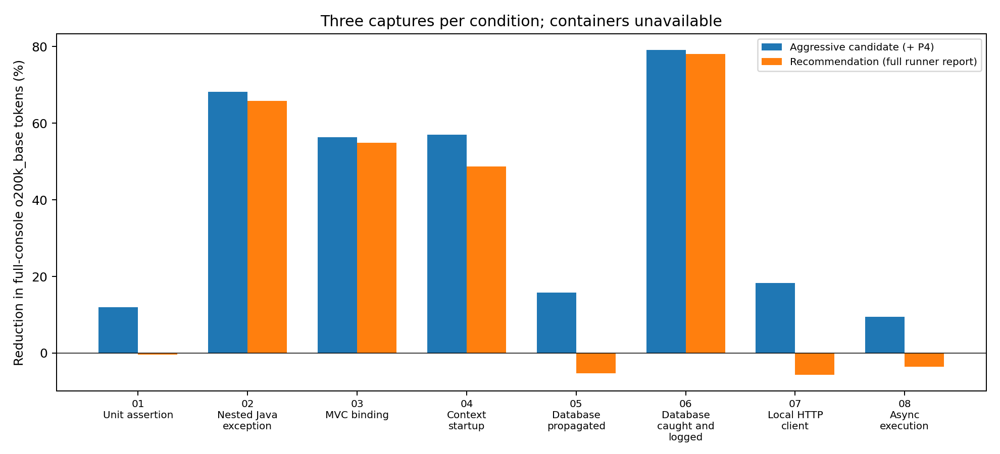
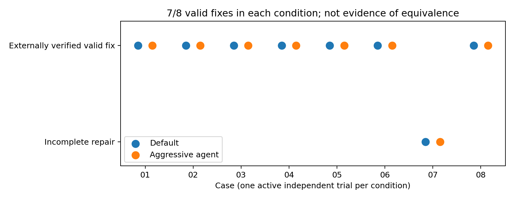

# An opt-in Spring Boot logging profile for agent debugging

An empirical investigation, 30 September–1 October 2026. Local template application; exploratory study, not a non-inferiority trial.

## Abstract

We implemented ten isolated Java failure fixtures in a Kotlin Spring Boot template, executed 114 final ablation measurements across eight runnable cases (three repetitions per applicable condition), and measured a revised conservative bundle in another 24 runs. Real-container cases were blocked by an unavailable Docker daemon. On full console captures, the aggressive candidate reduced summed `o200k_base` tokens by **58.7%**; the conservative recommendation reduced them by **53.3%**. These are exact counts under a named reference tokenizer, **not established Astra-specific token counts**.

Fresh Codex sessions actually read debugging-tool output. Sixteen sessions performed debugging, one per runnable case and condition, and produced **7/8 externally verified valid fixes in each condition**. The original 48-slot schedule exhausted account usage; 36 attempts performed no debugging and are excluded from those denominators. Four supplemental sessions covered the missing cases after reset. In the 16 active trials, reference tokens in initial complete-log reads fell 48.5%, and reference tokens in all log-related command results fell 38.2%. Across the 7 matched case pairs with complete usage records, actual session input tokens fell 6.2%. This small, quota-limited, sandbox-confounded sample does not establish unchanged debugging ability or a general session-token saving. Test-runner trimming erased useful source frames; it remains opt-in and is omitted from the final recommended bundle, which was measured but not directly blind-tested.

## 1. Questions and hypotheses

RQ1: Does formatting reduce generated output, selected text, and text actually returned by debugging tools? RQ2: Do agents still identify and repair the defects? H1 predicts reduced log-related input; H2 predicts no meaningful degradation in correct fixes. We distinguish these endpoints and do not infer H2 from H1. No equivalence margin, statistical power calculation, randomized population sample, or sufficiently repeated debugging sample was available. A finding of equal successes is descriptive.

## 2. Environment and methods

The untouched template declared Java 25, Kotlin 2.3.21 and Spring Boot 4.1.1. It used Maven, Kotlin source directories, `spring-boot-starter`, `spring-boot-starter-test`, Kotlin JUnit integration and Logback. It had one ordinary context-loading test and no application-specific MVC, database, HTTP-client, or Testcontainers code. New experimental code is Java in `investigation/src/test/java`, added only by the Maven `investigation` profile; no language migration occurred. Dependencies added under that profile are Spring MVC, Jakarta Servlet, H2, Testcontainers PostgreSQL and PostgreSQL JDBC. The HTTP client is Spring RestClient against a JDK loopback HttpServer.

| Component | Observed version/state |
| --- | --- |
| JDK used | OpenJDK 25, macOS aarch64 (shell initially selected Temurin 17.0.13) |
| Maven / wrapper | 3.9.16 |
| Spring / Boot | 7.0.9 / 4.1.1 |
| Logback / JUnit platform | 1.5.38 / 6.0.3 |
| Surefire / H2 / Testcontainers | 3.5.6 / 2.4.240 / 2.0.5 |
| Python / tiktoken | 3.9 / 0.14.0; o200k_base vocabulary |
| Codex | 0.154.0-alpha.6.2; gpt-6-astra; low reasoning effort |
| Docker client | 29.6.2; daemon unavailable at Docker Desktop socket |
| Git / instructions | No .git repository; no applicable AGENTS.md found; original POM and application YAML preserved |


See [environment/final.json](environment/final.json), [requirements-lock.txt](requirements-lock.txt), and the [original files](original/). Maven resolves the declared versions successfully with approved network access; no downgrade was used. Initial sandbox DNS/socket/Kotlin-daemon failures are retained under `environment/`. `DEBUG=release` in the inherited environment activated verbose Boot output in the first baseline; the measurement runner removes that variable and injected Spring/logging/JVM options consistently. Neither shared CI nor global profiles were changed. Ordinary tests pass with and without `agent`: [normal-tests.json](environment/normal-tests.json).

### 2.1 Experimental units and resets

Each matrix unit is one forked JVM executing one JUnit scenario. H2 is a fresh in-memory database, connections are closed, executors are closed, and the HTTP stub binds an ephemeral loopback port and stops in `finally`. Maven matrix runs are serial, with a 100-second process-group timeout and five-second termination grace. The runner uses already compiled sources and `surefire:test`; blind trials run the complete `test` lifecycle and therefore include compilation noise. Exact commands, statuses, identity checks, source/class hashes, and profile evidence accompany each raw run. Case 01 intentionally has no Spring context: profile activation is not applicable there; its `profile_verified=true` metadata means “no runtime profile required,” not that Spring started. Every final v2 and conservative run triggers the intended failure and returns exit 1. Repetition ranges measure formatting/runtime variability, not diagnostic population uncertainty.

### 2.2 Provenance and producer control

| Artifact/producer | What can affect it |
| --- | --- |
| Application logger stdout | P1 prefix, P2 exception rendering; P3 only the duplicate caught-database path |
| Spring startup stdout | P1 and P2; P3 does not change Boot exception ownership |
| Surefire/Maven stdout + stderr | P4 affects Surefire failure rendering; a Spring profile does not control Maven summaries |
| Surefire XML/text reports | P4 affects report exception text; XML also embeds application output affected by P1–P3 |
| Container STDOUT / STDERR | Container process; none of P1–P4 rewrites it |
| Host readiness / runtime failure | Testcontainers logger and propagated exception; P1/P2/P4 may affect host rendering, not underlying readiness reason |
| Derived extraction | Fixed parser rules only; never overwrite raw logs |


Raw stdout and stderr are separate; a “complete console” is their deterministic concatenation, not a claim of interleaved event ordering. Source paths, byte counts, line counts, SHA-256 hashes, producer labels and token counts are in [artifacts-v2.csv](artifacts-v2.csv). [The full raw-artifact inventory](raw-artifact-inventory.csv) also indexes every excluded pilot and interrupted capture. [verification.json](verification.json) checks final identities, one failing test per report, report counts, original application YAML preservation and raw hashes. Application and startup events share stdout with runner output, explicitly labeled as mixed production; they are not mislabeled as a single exception report. Generated reports are measured individually and are not silently added to console totals. Container consumers are implemented to retain host and container output separately, with container STDOUT and STDERR files; no container-output aggregate is reported because no real container ran.

## 3. Failure cases and predefined diagnostics

| Case | Mechanism and intended cause | Objective valid-fix criterion | Required initial facts |
| --- | --- | --- | --- |
| 01 | Unit assertion: total adds quantity instead of multiplying | 10 × 3 = 30 | expected_actual, location |
| 02 | Nested Java exception: invalid numeric port eighty | connect completes with a valid numeric port | outer, cause, root, suppressed, location |
| 03 | MVC binding: client passes word two to integer request parameter | GET yields 200 and count=2 | binding, request, status, location |
| 04 | Context startup: port bean parses nonnumeric configuration | context starts and provides port bean | bean, root, value, spring_frame, location |
| 05 | Database propagated: two users have same email | two rows with distinct emails persisted | sql, constraint, location |
| 06 | Database caught and logged: duplicate email caught, logged twice, returns false | two distinct users persist; saveCaught returns true | sql, constraint, request, location |
| 07 | Local HTTP client: client requests /wrong instead of /price | controlled stub returns price 42 | status, request, body, location |
| 08 | Async execution: worker parses ten as decimal integer | worker returns 10 within five seconds | wrapper, root, worker, request, location |
| 09 | PostgreSQL container: duplicate email in PostgreSQL | two distinct users persist in PostgreSQL | constraint, sql, location |
| 10 | Container readiness: readiness regex expects service while process announces worker | actual worker-ready container starts before timeout | readiness, container, runtime |


The exact fact substrings were written in [cases.json](cases.json) before the final matrix. Case 02 additionally checks that the repaired connection returns 8080; case 04 checks `port=8080`. Case 09 verifies two distinct emails after insertion. Case 07 is a discovered two-stage defect: the initial 404 is caused by `/wrong`, but changing it to `/price` exposes `UnknownContentTypeException` because an untyped numeric body has no Integer message converter. A complete repair reads the body as String and parses it. The initial checklist cannot prove preservation of information about this not-yet-triggered second failure. The first failed reference repair is preserved in [positive-controls/07.stdout](positive-controls/07.stdout); all eight complete reference repairs pass in [positive-controls-v2/results.json](positive-controls-v2/results.json). Those repairs and evaluation metadata were never copied into debugging-agent workspaces.

Cases 09–10 use real Testcontainers objects, PostgreSQL 17.6-alpine and Alpine 3.22.1. Case 10 runs a real process announcing `worker ready` while waiting for `service ready`; the wait is eight seconds and the process lifetime is 45 seconds. Docker’s elevated probe still reported an unavailable daemon. Thus constraint/readiness failures from real containers remain **unobserved**; runtime-unavailability attempts are not counted as successful injections. [Docker blocker](environment/docker.stderr). Four actual host attempts (default and aggressive for each container case) also failed with `Could not find a valid Docker environment`; [raw attempts](raw/container-blocker/) and [metrics](artifacts-container-blocker.csv) are explicitly excluded from intended-failure and savings results. No container stdout/stderr exists because startup did not reach container creation.

## 4. Configurations and final recommendation

### P1–P4

P1 shortens timestamps to local time with milliseconds, removes repeated PID/application-name/separator fields, eliminates padding, retains the full thread name and uses Logback logger abbreviation. P2 removes complete JUnit, Surefire and non-module-qualified Java reflection frame lines from application-logged exceptions using Logback `%replace`; it retains Spring, JDBC, HTTP and executor frames, exception headers, messages, causes, suppressed exceptions, application frames and normal common-frame elision. `%nopex` prevents Logback from appending another automatic trace. No custom converter is needed. Module-qualified Java frames do not match this narrow regex and remain.

P3 applies only to case 06: the same caught SQLException was logged by two layers. The treatment retains the first full exception and both ERROR events, replacing the second trace with an explicit reference containing the same request ID. This is sole-owner logging, not a global stateful exception suppressor; messages or unrelated failures are never dropped. P4 is Maven Surefire `trimStackTrace=true`, separately enabled by `-Pagent-reports`. It cannot be enabled by a Spring profile alone.

| Identifier | Enabled mechanisms |
| --- | --- |
| default | Boot and Surefire defaults |
| p1 | Prefix only; negative control in context-free case 01 |
| p2 | Application exception filtering only |
| p3 | Sole-owner caught-database logging only |
| p4 | Surefire trimming only |
| agent | Aggressive candidate: P1+P2+P3+P4; treatment in blind trials |
| safe | Final conservative bundle: P1+P2+P3, full Surefire reports; actual Spring profile is agent |


P2 is N/A for cases 01, 05, 07 and 09: their failure trace is not application-logged. P3 is N/A except case 06. The matrix runs only applicable single-mechanism conditions (plus P1 as an explicit negative control for case 01). The conservative bundle is deliberately not named a second Spring profile: the distinction is whether the separate Maven trimming option is added.

### Exact opt-in application-agent.yml

```yaml
# Opt-in local console formatting. No log levels or application behavior change.
logging:
  pattern:
    console: "%d{HH:mm:ss.SSS} %level [%thread] %logger{36}: %msg%n%replace(%wEx){'(?m)^[ \\t]+at (?:org\\.junit\\.|org\\.apache\\.maven\\.surefire\\.|java\\.lang\\.reflect\\.|jdk\\.internal\\.reflect\\.)[^\\r\\n]*[\\r\\n]+',''}%nopex"
  exception-conversion-word: "%replace(%wEx){'(?m)^[ \\t]+at (?:org\\.junit\\.|org\\.apache\\.maven\\.surefire\\.|java\\.lang\\.reflect\\.|jdk\\.internal\\.reflect\\.)[^\\r\\n]*[\\r\\n]+',''}"
```

The exception expression appears inline in the console pattern to avoid Spring-versus-Logback placeholder timing; the `logging.exception-conversion-word` property supplies the same policy for Boot-managed exception rendering. Normal inactive-profile logging is unchanged. Test resources `application-p1.yml` and `application-p2.yml` exist only for the experiment. Effective profiles and pattern properties are printed once per Spring fixture, and their instrumentation tokens are included in complete captures; this penalizes longer pattern settings rather than hiding their overhead.

### Developer command

Set Java 25, then use the conservative recommendation:

```sh
env -u DEBUG mvn -Dmaven.repo.local="$PWD/investigation/.m2" -Dspring.profiles.active=agent test
```

An ordinary developer may omit the local repository override if dependencies are in their normal Maven cache. Add `-Dkotlin.compiler.daemon=false` if working inside the restricted local sandbox. Do **not** add `-Pagent-reports` by default: P4 erased `Defects.java` locations in propagated database and HTTP failures. It remains available as an explicitly measured tradeoff. For a fully configured deliberate case, use the command in [README.md](README.md).

## 5. Measurements and reading methods

### 5.1 Token and agent-input definitions

All artifact token counts use real `tiktoken 0.14.0`, `o200k_base`, with special-looking text treated as ordinary text. No bytes-per-token estimate is used. `encoding_for_model("gpt-6-astra")` raises a mapping error in the installed package, so exact Astra-specific log-token attribution is **unavailable**. The reference encoding enables reproducible text comparisons. Separately, Codex `turn.completed.usage` supplies actual session input, cached input, output and reasoning-output usage when the turn completes. These counts include instructions, source reads, tool protocol and repeated context; they are not interchangeable with a tokenized file.

Completed command events contain `aggregated_output`; these returned strings are saved individually in `returned-tool-text/` and measured in [tool-results-v1.csv](tool-results-v1.csv) and [tool-results-supplemental.csv](tool-results-supplemental.csv). This captures the CLI-visible tool-result body, not the hidden model wire envelope or its overhead. Log-related results are commands reading failure logs/reports or invoking tests; mixed commands can include source/environment text, so their count is a broad observable category, not exact causal log attribution. Pure initial `cat failure.log` reads are reported separately. No output stored on disk is counted as model input merely because it exists.

### 5.2 Fixed extraction protocol

| Method | Exact rule |
| --- | --- |
| complete | stdout followed by stderr, without truncation |
| window20 | First documented failure-marker line and the next 19 raw lines |
| filtered40 | First marker and next 39 raw lines, then remove frame lines matching Spring/JUnit/Apache/java/jdk/Logback packages |
| boundary | First failure event through the line before Maven’s post-test Results section |
| dedup | Same boundary; replace only byte-identical complete exception blocks with an explicit repeat reference; preserve each event header/context |


The fixed marker regex recognizes the fixture’s ERROR messages (`client setup failed`, `GET /orders`, `save users failed`, `invoice-42`, `Application run failed`) or Surefire `<<< FAILURE!` / `<<< ERROR!` lines. It ignores startup and profile-verification lines. Matching and boundary code is in [analyze.py](scripts/analyze.py); each output records match count, extraction command, source, size and fact outcomes. The rules are identical across conditions and never expanded until a desired cause appears. “20 lines after marker” is defined here to include the marker, so the policy is exactly 20 lines total. Framework filtering occurs **after** selecting 40 raw lines; filtering does not refill the window.

Boundary extraction is fixture-aware, not a universal production log parser. It can retain both an application exception and the runner’s later report, intervening events and `CASE_END`; those are observed duplication/unrelated output, not additional independent failures. Exact-block dedup does not merge merely similar exceptions, different request headers or different throwables. All final extracted artifacts are no larger than their full concatenated source; the dedup reference is additional formatting, counted in its size.

### 5.3 Per-case full console results

Mean [minimum–maximum] over three repetitions. Counts include Maven overhead and explicit profile evidence. “Safe” is the recommended untrimmed-report configuration.

| Case | Default bytes | Safe bytes | Default tokens | Aggressive tokens | Safe tokens | Safe change |
| --- | --- | --- | --- | --- | --- | --- |
| 01 | 2,784.0 [2,784–2,784] | 2,794.0 [2,794–2,794] | 704.0 [704–704] | 620.0 [620–620] | 707.0 [707–707] | -0.4% reduction |
| 02 | 16,987.0 [16,987–16,987] | 5,851.7 [5,851–5,852] | 4,799.0 [4,799–4,799] | 1,523.0 [1,523–1,523] | 1,642.0 [1,642–1,642] | 65.8% reduction |
| 03 | 21,197.0 [21,197–21,197] | 9,822.0 [9,822–9,822] | 5,920.0 [5,920–5,920] | 2,586.0 [2,586–2,586] | 2,673.0 [2,673–2,673] | 54.8% reduction |
| 04 | 25,088.0 [25,088–25,088] | 13,750.7 [13,750–13,751] | 6,632.0 [6,632–6,632] | 2,850.0 [2,850–2,850] | 3,403.0 [3,403–3,403] | 48.7% reduction |
| 05 | 4,873.7 [4,873–4,874] | 5,022.7 [5,022–5,023] | 1,333.0 [1,333–1,333] | 1,123.0 [1,123–1,123] | 1,404.0 [1,404–1,404] | -5.3% reduction |
| 06 | 31,672.0 [31,672–31,672] | 6,705.0 [6,705–6,705] | 9,234.0 [9,234–9,234] | 1,931.0 [1,931–1,931] | 2,018.0 [2,018–2,018] | 78.1% reduction |
| 07 | 4,923.0 [4,923–4,923] | 5,071.3 [5,071–5,072] | 1,260.0 [1,260–1,260] | 1,029.0 [1,029–1,029] | 1,331.0 [1,331–1,331] | -5.6% reduction |
| 08 | 5,106.3 [5,106–5,107] | 5,206.0 [5,206–5,206] | 1,393.0 [1,393–1,393] | 1,261.0 [1,261–1,261] | 1,442.0 [1,442–1,442] | -3.5% reduction |


Cases 09–10: unavailable; no zero values or simulated savings are substituted. [All extraction results, CSV](results-v2.csv), [JSON](results-v2.json), [conservative CSV](results-conservative-v2.csv).



### 5.4 Ablations

Mean complete-console reference tokens; dash means not applicable.

| Case | Default | P1 | P2 | P3 | P4 | Aggressive | Safe |
| --- | --- | --- | --- | --- | --- | --- | --- |
| 01 | 704.0 | 705.0 | — | — | 620.0 | 620.0 | 707.0 |
| 02 | 4,799.0 | 4,732.0 | 1,654.0 | — | 4,683.0 | 1,523.0 | 1,642.0 |
| 03 | 5,920.0 | 5,763.0 | 2,775.0 | — | 5,836.0 | 2,586.0 | 2,673.0 |
| 04 | 6,632.0 | 6,494.0 | 3,483.0 | — | 6,082.0 | 2,850.0 | 3,403.0 |
| 05 | 1,333.0 | 1,288.0 | — | — | 1,055.0 | 1,123.0 | 1,404.0 |
| 06 | 9,234.0 | 9,145.0 | 2,883.0 | 5,198.0 | 9,150.0 | 1,931.0 | 2,018.0 |
| 07 | 1,260.0 | 1,215.0 | — | — | 961.0 | 1,029.0 | 1,331.0 |
| 08 | 1,393.0 | 1,326.0 | 1,454.0 | — | 1,215.0 | 1,261.0 | 1,442.0 |


P1 alone barely changes the context-free assertion, because Spring formatting cannot affect it. P2 alone increases async complete-console size: it removes few worker frames while the effective-configuration line adds the regex. This is a real unfavorable measurement, not omitted noise. P3 is particularly effective for the duplicated caught database trace. The conservative bundle increases complete-console counts for cases 01, 05, 07 and 08: the preserved runner report and printed effective-pattern instrumentation can outweigh prefix savings. These observations show why file-wide or pooled savings cannot be applied universally.

### 5.5 Extraction and diagnostic survival

Each cell reports reference-token mean followed by required facts retained/required in repetition 1. Full machine-readable per-run fact maps are in the result files.

| Case / configuration | Complete | 20 lines | Filtered 40 | Boundary | Dedup |
| --- | --- | --- | --- | --- | --- |
| 01 / default | 704.0; 2/2 | 294.0; 2/2 | 466.0; 2/2 | 204.0; 2/2 | 204.0; 2/2 |
| 01 / agent | 620.0; 2/2 | 295.0; 2/2 | 467.0; 2/2 | 119.0; 2/2 | 119.0; 2/2 |
| 01 / safe | 707.0; 2/2 | 294.0; 2/2 | 469.0; 2/2 | 204.0; 2/2 | 204.0; 2/2 |
| 02 / default | 4,799.0; 5/5 | 691.0; 2/5 | 107.0; 2/5 | 3,973.0; 5/5 | 3,973.0; 5/5 |
| 02 / agent | 1,523.0; 5/5 | 372.0; 5/5 | 467.0; 5/5 | 628.0; 5/5 | 628.0; 5/5 |
| 02 / safe | 1,642.0; 5/5 | 372.0; 5/5 | 464.0; 5/5 | 745.0; 5/5 | 745.0; 5/5 |
| 03 / default | 5,920.0; 4/4 | 745.0; 3/4 | 188.0; 4/4 | 4,848.0; 4/4 | 4,848.0; 4/4 |
| 03 / agent | 2,586.0; 4/4 | 723.0; 3/4 | 183.0; 4/4 | 1,535.0; 4/4 | 1,535.0; 4/4 |
| 03 / safe | 2,673.0; 4/4 | 723.0; 3/4 | 183.0; 4/4 | 1,620.0; 4/4 | 1,620.0; 4/4 |
| 04 / default | 6,632.0; 5/5 | 790.0; 3/5 | 126.0; 3/5 | 5,392.0; 5/5 | 5,392.0; 5/5 |
| 04 / agent | 2,850.0; 5/5 | 768.0; 3/5 | 194.0; 5/5 | 1,613.0; 5/5 | 1,613.0; 5/5 |
| 04 / safe | 3,403.0; 5/5 | 768.0; 3/5 | 194.0; 5/5 | 2,164.0; 5/5 | 2,164.0; 5/5 |
| 05 / default | 1,333.0; 3/3 | 390.0; 2/3 | 666.0; 3/3 | 445.0; 3/3 | 445.0; 3/3 |
| 05 / agent | 1,123.0; 2/3 | 323.0; 2/3 | 559.0; 2/3 | 166.0; 2/3 | 166.0; 2/3 |
| 05 / safe | 1,404.0; 3/3 | 390.0; 2/3 | 666.0; 3/3 | 445.0; 3/3 | 445.0; 3/3 |
| 06 / default | 9,234.0; 4/4 | 670.0; 3/4 | 747.0; 4/4 | 8,392.0; 4/4 | 8,346.0; 4/4 |
| 06 / agent | 1,931.0; 4/4 | 648.0; 3/4 | 904.0; 4/4 | 1,020.0; 4/4 | 1,020.0; 4/4 |
| 06 / safe | 2,018.0; 4/4 | 648.0; 3/4 | 884.0; 4/4 | 1,105.0; 4/4 | 1,105.0; 4/4 |
| 07 / default | 1,260.0; 4/4 | 420.0; 4/4 | 393.0; 4/4 | 420.0; 4/4 | 420.0; 4/4 |
| 07 / agent | 1,029.0; 3/4 | 293.0; 3/4 | 465.0; 3/4 | 120.0; 3/4 | 120.0; 3/4 |
| 07 / safe | 1,331.0; 4/4 | 420.0; 4/4 | 396.0; 4/4 | 420.0; 4/4 | 420.0; 4/4 |
| 08 / default | 1,393.0; 4/5 | 411.0; 4/5 | 353.0; 4/5 | 559.0; 4/5 | 559.0; 4/5 |
| 08 / agent | 1,261.0; 5/5 | 362.0; 5/5 | 484.0; 5/5 | 358.0; 5/5 | 358.0; 5/5 |
| 08 / safe | 1,442.0; 5/5 | 389.0; 5/5 | 331.0; 5/5 | 537.0; 5/5 | 537.0; 5/5 |


Substring survival is a necessary-content proxy, not proof of comprehension. It does not establish semantic completeness, readable causal ordering, or a successful repair. Default async output truncates `invoice-worker-7`; the agent pattern retains it, so default fails the strict full-thread-name fact although its suffix and request ID still help. Conversely, P4 removes application source frames in cases 05 and 07 even from the complete console. The conservative bundle restores them. In case 02, both fixed default windows miss the nested causes and suppressed cleanup exception because framework frames consume the window; filtering after the window cannot recover unseen lines. Context startup similarly exceeds fixed windows. Removing Spring frames from filtered windows can also erase useful lifecycle context even when a broad substring fact survives. No window is silently enlarged.

The pooled full-console reduction is 58.7% for the aggressive candidate and 53.3% for the recommendation, computed as `1 − sum(treatment tokens)/sum(default tokens)` across eight cases × three repetitions. Every case has equal repetition count, but long traces carry more weight. No container cases are included; this is not an average percentage across projects, reading methods or sessions.

## 6. Direct debugging trials

Each trial used a new external temporary project with the same defective implementation for its case, model `gpt-6-astra`, low reasoning effort and a 120-second wall-time cap. No conversation was resumed. The workspace included source/tests and a complete failing console log, but no case manifest, reference fixes, earlier logs, report, transcripts or outcome metadata. The prompt asked the model to read `failure.log`, make the smallest behavioral repair in `Defects.java` only, and verify with `./test.sh`; it prohibited disabling functionality or changing expectations. Full stdout/stderr remained available. Immutable files were checked and restored before an independent external test run. All active trial patches and diagnoses were reviewed; no test expectation changes or functionality-disabling patches were observed.

The shared dependency cache and installed tools were allowed; other outside reads were prohibited by instructions. This is protocol isolation rather than a sealed adversarial evaluation. Parallel independent copies avoid source and report collisions, but CPU contention and cache state may affect time. The original schedule alternated condition order by repetition. Quota prevented repetitions 2–3 from doing work. Twelve original sessions produced patches (one was interrupted by quota after its patch); four supplemental sessions completed the HTTP/async pairs after reset. Pilot trials are retained but excluded from primary outcomes because they preceded final fixture/profile instrumentation. **There is one active trial per case and condition, not three.**

| Case | Default valid fix | Agent valid fix | Default seconds to external verification | Agent seconds | Root cause |
| --- | --- | --- | --- | --- | --- |
| 01 | 1/1 | 1/1 | 40.2 | 41.6 | Correct in both |
| 02 | 1/1 | 1/1 | 46.8 | 45.9 | Correct in both |
| 03 | 1/1 | 1/1 | 68.0 | 58.9 | Correct in both |
| 04 | 1/1 | 1/1 | 62.6 | 67.3 | Correct in both |
| 05 | 1/1 | 1/1 | 55.5 | 42.7 | Correct in both |
| 06 | 1/1 | 1/1 | 51.7 | 46.4 | Correct in both |
| 07 | 0/1 | 0/1 | unresolved | unresolved | Initial cause correct in both; HTTP second failure unresolved |
| 08 | 1/1 | 1/1 | 38.5 | 45.0 | Correct in both |




Both HTTP agents changed only the route and stopped without resolving the second failure. External verification returned 1 with `UnknownContentTypeException`; these are incomplete, not valid or superficial test-bypassing fixes. The other seven repairs in each condition are narrowly targeted and pass. Async patches preserve the executor and exception propagation. The quota-interrupted database default patch is externally valid but has no completed session usage record. Model-declared verification is not treated as authoritative: some agents reported being blocked by Kotlin daemon filesystem/socket restrictions, while external verification could run. This environmental friction limits conclusions about autonomous time-to-fix. The displayed successful time sums session wall time and external verification; it excludes initial setup, and is an upper bound on patch discovery time, not a measured first-success timestamp inside the session.

### 6.1 Returned text, tool calls and actual usage

| Case / condition | Log-related calls | Pure initial-read reference tokens | All log-related reference tokens | Input tokens | Cached input | Output tokens |
| --- | --- | --- | --- | --- | --- | --- |
| 01 / agent | 5 | 1193 | 4559 | 85508 | 76672 | 535 |
| 01 / default | 5 | 1275 | 4619 | 85821 | 62976 | 561 |
| 02 / agent | 5 | 2118 | 5917 | 129242 | 98688 | 681 |
| 02 / default | 5 | 5395 | 9070 | 104451 | 89856 | 634 |
| 03 / agent | 6 | 3177 | 19140 | 169157 | 130688 | 868 |
| 03 / default | 7 | 6520 | 23480 | 278536 | 256384 | 958 |
| 04 / agent | 7 | 3475 | 20663 | 285812 | 263040 | 1109 |
| 04 / default | 7 | 7253 | 24708 | 198738 | 148608 | 842 |
| 05 / agent | 5 | 1719 | 5689 | 90642 | 67328 | 607 |
| 05 / default | 6 | 1929 | 17691 | 176220 | 159488 | 931 |
| 06 / agent | 5 | 2526 | 6495 | 92253 | 81280 | 579 |
| 06 / default | 6 | 9846 | 25393 | unavailable | unavailable | unavailable |
| 07 / agent | 4 | 3456 | 4169 | 116879 | 104960 | 579 |
| 07 / default | 4 | 3680 | 6317 | 96397 | 84352 | 524 |
| 08 / agent | 5 | 1856 | 5825 | 90602 | 79232 | 616 |
| 08 / default | 5 | 1993 | 5879 | 91485 | 79744 | 574 |


Across 16 active sessions, pure initial returned-log reads shrink by 48.5% under the reference encoding; all log-related command result bodies shrink by 38.2%. Fuller-output requests matching the documented original-stream/report rule: 0. This does not mean no repeated reading: reruns and source/environment inspection are included in the transcripts. Returned output may be tool-truncated; detected truncation markers across completed command results: 0. These markers are a string-based indicator, not proof that every unmarked result was untruncated. Raw files remain complete.

For actual session usage, compare only matched cases 01, 02, 03, 04, 05, 07, 08; case 06 is excluded because its default session was quota-interrupted. Summed default/agent input tokens are **1,031,648 / 967,842**, a descriptive 6.2% decrease. Cached input is **881,408 / 820,608** and output tokens are **5,024 / 4,995**. Individual sessions include both increases and decreases. Cache state, differing tool retries, large fixed instructions, read repetition and sandbox failures dominate some sessions. No claim that the log profile caused this exact total-session difference is justified. Do not sum cached input on top of input, or add separately reported reasoning tokens to output without knowing the provider’s accounting semantics.

Transcripts, patches, diagnoses and verification are under [trials/v1](trials/v1/) and [trials/supplemental](trials/supplemental/); summaries are [trial-results-v1.csv](trial-results-v1.csv) and [supplemental CSV](trial-results-supplemental.csv). Empty/no-patch quota attempts are distinguishable in each `outcome.json` and are not unresolved debugging attempts. The runner now stops scheduling work after a quota error. The conservative revised bundle was **not** the treatment in these trials: its application profile is identical, but P4 is omitted. Its debugging performance remains directly unmeasured.

## 7. Interpretation, tradeoffs and financial implications

The strongest supported finding is that the captured/generated text and the returned initial tool-result bodies can be smaller. These are distinct from total model input and successful diagnosis. Narrow exception filtering produces the main reduction for application-logged failures. Keeping all Spring/JDBC/HTTP frames is important because startup, SQL and HTTP diagnoses can rely on those frameworks. The parser still removes JUnit/reflection details that would matter if the test engine or reflection itself were broken; use default logs for such investigations. The experiment deliberately does not suppress ERROR, lower log levels or truncate at an arbitrary byte limit.

Short timestamps lose date/time-zone context across midnight; removing PID and constant application name assumes a single captured process/application. Logger abbreviation can collide; full thread names may be long but were useful here. The tested pattern does not explicitly include arbitrary MDC or tracing correlation fields; request context in these fixtures is in the message. It is unsuitable as a drop-in assumption for every distributed tracing setup without extension and re-evaluation. P3 cannot be generalized from identical caught objects to unrelated exceptions with equal messages. P4’s information loss is why the final recommendation retains full runner reports.

No current price schedule is assumed. Given explicitly supplied prices per million uncached input, cached input and output tokens, compute cost as `((I−C)×p_uncached + C×p_cached + O×p_output)/1e6`, then compare sessions with complete usage. Repeated reads and caching can make equal log-token reductions yield different monetary changes. A byte reduction or reference-encoding count alone is not a dollar saving.

## 8. Limitations and threats to validity

- Eight runnable toy failures in one template, with two real-container cases blocked; no generalization to production outages or multilingual stacks.
- One active blind trial per case/condition, resource-limited and partly resumed after a calendar/account reset; no equivalence claim or statistical non-inferiority conclusion.
- Account quota and sandbox verification restrictions confound time and usage. A valid externally verified patch is not necessarily a completed autonomous repair session.
- The final conservative bundle was selected after observing source-frame loss on these same cases and was not separately blind-tested; adaptive selection and no holdout set limit validation.
- Exact model-specific log-token attribution is unavailable; reference-tokenizer results and actual whole-session usage must remain separate. CLI tool bodies omit hidden protocol overhead.
- Diagnostic facts are substring checks. The HTTP second failure demonstrates their incompleteness. Supplied tests are small; manual patch review reduces but cannot eliminate test-overfitting risk.
- The preliminary pilots include harness/configuration mistakes and an interrupted conservative batch. They are preserved, excluded from final pooled results, and documented in [amendments.json](amendments.json).
- V1 P2-only settings were ineffective; v2 corrects them. Initial concurrent pilot reports were not reliably isolated, so no claims rely on their report completeness. The final v2 and conservative-v2 raw reports are isolated.
- Live source instrumentation changed between pilot/final runs; only designated final batches are pooled. Main behavioral defects stayed fixed during final comparisons; debug-only container log-capture additions do not alter non-container behavior.

## 9. Conclusions

The opt-in profile demonstrably reduces captured and selected log text for these cases under a documented reference tokenizer, and actual debugging sessions received smaller initial log-result bodies. Actual total-session input also differed in the matched observed sessions, but causality and general savings are not established. Observed valid-fix counts were equal at 7/8 per condition; both conditions failed to complete the two-stage HTTP repair. This supports continued evaluation, **not** the assertion that debugging ability is unaffected. Real-container behavior, repeated blind trials and direct testing of the final conservative bundle remain outstanding. The recommended practical configuration is the Spring `agent` profile with full Surefire reports.

## Appendix A. Commands and exact configurations

All reproduction commands, prerequisites and clean-state rules are in [README.md](README.md). The authoritative per-run commands are in `raw/*/*/*/*/metadata.json`; the authoritative trial invocation and budget are in `trials/*/*/*/*/outcome.json`. Primary runs:

```sh
python3 investigation/scripts/run.py --batch v2 --workers 1
python3 investigation/scripts/run.py --batch conservative-v2 --configs safe --workers 1
investigation/.venv/bin/python investigation/scripts/analyze.py --batch v2
investigation/.venv/bin/python investigation/scripts/analyze.py --batch conservative-v2
python3 investigation/scripts/trials.py --batch v1 --repeats 3 --workers 2 --seconds 120
python3 investigation/scripts/trials.py --cases 07,08 --repeats 1 --batch supplemental --workers 2 --seconds 120
```

These batch names already exist and are protected against overwrite; use fresh names for reproduction. Compile the `investigation` Maven profile first. Ordinary Maven builds must not overlap matrix execution because they can remove experimental classes.

## Appendix B. Representative unmodified excerpts

Excerpts below are bounded illustrations, not the inputs used to compute full-log metrics. Complete sources are linked.

### Before: nested exception

[Complete raw stdout](raw/v2/02/default/1/stdout.log)

```text
2026-09-30T19:24:23.385+02:00 ERROR 39116 --- [token.usage] [           main] com.ai.token.experiment.Defects          : client setup failed

java.lang.IllegalStateException: cannot initialize client
	at com.ai.token.experiment.Defects.connect(Defects.java:21) ~[test-classes/:na]
	at com.ai.token.experiment.FailureCasesTest.scenario(FailureCasesTest.java:41) ~[test-classes/:na]
	at java.base/jdk.internal.reflect.DirectMethodHandleAccessor.invoke(DirectMethodHandleAccessor.java:104) ~[na:na]
	at java.base/java.lang.reflect.Method.invoke(Method.java:565) ~[na:na]
	at org.junit.platform.commons.util.ReflectionUtils.invokeMethod(ReflectionUtils.java:701) ~[junit-platform-commons-6.0.3.jar:6.0.3]
	at org.junit.platform.commons.support.ReflectionSupport.invokeMethod(ReflectionSupport.java:502) ~[junit-platform-commons-6.0.3.jar:6.0.3]
	at org.junit.jupiter.engine.support.MethodReflectionUtils.invoke(MethodReflectionUtils.java:45) ~[junit-jupiter-engine-6.0.3.jar:6.0.3]
	at org.junit.jupiter.engine.execution.MethodInvocation.proceed(MethodInvocation.java:61) ~[junit-jupiter-engine-6.0.3.jar:6.0.3]
	at org.junit.jupiter.engine.execution.InvocationInterceptorChain$ValidatingInvocation.proceed(InvocationInterceptorChain.java:124) ~[junit-jupiter-engine-6.0.3.jar:6.0.3]
	at org.junit.jupiter.engine.extension.TimeoutExtension.intercept(TimeoutExtension.java:163) ~[junit-jupiter-engine-6.0.3.jar:6.0.3]
	at org.junit.jupiter.engine.extension.TimeoutExtension.interceptTestableMethod(TimeoutExtension.java:148) ~[junit-jupiter-engine-6.0.3.jar:6.0.3]
	at org.junit.jupiter.engine.extension.TimeoutExtension.interceptTestMethod(TimeoutExtension.java:86) ~[junit-jupiter-engine-6.0.3.jar:6.0.3]
	at org.junit.jupiter.engine.execution.InterceptingExecutableInvoker$ReflectiveInterceptorCall.lambda$ofVoidMethod$0(InterceptingExecutableInvoker.java:123) ~[junit-jupiter-engine-6.0.3.jar:6.0.3]
	at org.junit.jupiter.engine.execution.InterceptingExecutableInvoker.lambda$invoke$0(InterceptingExecutableInvoker.java:105) ~[junit-jupiter-engine-6.0.3.jar:6.0.3]
	at org.junit.jupiter.engine.execution.InvocationInterceptorChain$InterceptedInvocation.proceed(InvocationInterceptorChain.java:99) ~[junit-jupiter-engine-6.0.3.jar:6.0.3]
	at org.junit.jupiter.engine.execution.InvocationInterceptorChain.proceed(InvocationInterceptorChain.java:66) ~[junit-jupiter-engine-6.0.3.jar:6.0.3]
	at org.junit.jupiter.engine.execution.InvocationInterceptorChain.chainAndInvoke(InvocationInterceptorChain.java:47) ~[junit-jupiter-engine-6.0.3.jar:6.0.3]
	at org.junit.jupiter.engine.execution.InvocationInterceptorChain.invoke(InvocationInterceptorChain.java:39) ~[junit-jupiter-engine-6.0.3.jar:6.0.3]
	at org.junit.jupiter.engine.execution.InterceptingExecutableInvoker.invoke(InterceptingExecutableInvoker.java:104) ~[junit-jupiter-engine-6.0.3.jar:6.0.3]
	at org.junit.jupiter.engine.execution.InterceptingExecutableInvoker.invoke(InterceptingExecutableInvoker.java:98) ~[junit-jupiter-engine-6.0.3.jar:6.0.3]
	at org.junit.jupiter.engine.execution.InterceptingExecutableInvoker.invokeVoid(InterceptingExecutableInvoker.java:71) ~[junit-jupiter-engine-6.0.3.jar:6.0.3]
	at org.junit.jupiter.engine.descriptor.TestMethodTestDescriptor.lambda$invokeTestMethod$0(TestMethodTestDescriptor.java:219) ~[junit-jupiter-engine-6.0.3.jar:6.0.3]
	at org.junit.platform.engine.support.hierarchical.ThrowableCollector.execute(ThrowableCollector.java:74) ~[junit-platform-engine-6.0.3.jar:6.0.3]
```

### After (recommended): nested exception

[Complete raw stdout](raw/conservative-v2/02/safe/1/stdout.log)

```text
00:07:55.257 ERROR [main] com.ai.token.experiment.Defects: client setup failed

java.lang.IllegalStateException: cannot initialize client
	at com.ai.token.experiment.Defects.connect(Defects.java:21) ~[test-classes/:na]
	at com.ai.token.experiment.FailureCasesTest.scenario(FailureCasesTest.java:41) ~[test-classes/:na]
	at java.base/jdk.internal.reflect.DirectMethodHandleAccessor.invoke(DirectMethodHandleAccessor.java:104) ~[na:na]
	at java.base/java.lang.reflect.Method.invoke(Method.java:565) ~[na:na]
	at java.base/java.util.ArrayList.forEach(ArrayList.java:1604) ~[na:na]
	at java.base/java.util.ArrayList.forEach(ArrayList.java:1604) ~[na:na]
	at java.base/jdk.internal.reflect.DirectMethodHandleAccessor.invoke(DirectMethodHandleAccessor.java:104) ~[na:na]
	at java.base/java.lang.reflect.Method.invoke(Method.java:565) ~[na:na]
	Suppressed: java.io.IOException: cleanup socket failed
		at com.ai.token.experiment.Defects.connect(Defects.java:22) ~[test-classes/:na]
		... 82 common frames omitted
Caused by: java.io.IOException: invalid upstream port
	at com.ai.token.experiment.Defects.connect(Defects.java:20) ~[test-classes/:na]
	... 82 common frames omitted
Caused by: java.lang.NumberFormatException: For input string: "eighty"
	at java.base/java.lang.NumberFormatException.forInputString(NumberFormatException.java:67) ~[na:na]
	at java.base/java.lang.Integer.parseInt(Integer.java:565) ~[na:na]
	at java.base/java.lang.Integer.parseInt(Integer.java:662) ~[na:na]
	at com.ai.token.experiment.Defects.parsePort(Defects.java:16) ~[test-classes/:na]
	at com.ai.token.experiment.Defects.connect(Defects.java:18) ~[test-classes/:na]
	... 82 common frames omitted

CASE_END 02
```

Case 05: [default full console](extracted/v2/05/default/1/complete.txt), [aggressive full console](extracted/v2/05/agent/1/complete.txt), [conservative full console](extracted/conservative-v2/05/safe/1/complete.txt). These show the runner-frame loss and full-thread-name preservation respectively.

Case 08: [default full console](extracted/v2/08/default/1/complete.txt), [aggressive full console](extracted/v2/08/agent/1/complete.txt), [conservative full console](extracted/conservative-v2/08/safe/1/complete.txt). These show the runner-frame loss and full-thread-name preservation respectively.

## Appendix C. Primary documentation

The implementation was checked against [Spring Boot logging](https://docs.spring.io/spring-boot/reference/features/logging.html), [Logback pattern layouts](https://logback.qos.ch/manual/layouts.html), [Surefire test parameters](https://maven.apache.org/surefire/maven-surefire-plugin/test-mojo.html), and [OpenAI non-interactive Codex documentation](https://learn.chatgpt.com/docs/non-interactive-mode). Local CLI help and actual runtime behavior determine the commands recorded here. Official OpenAI documentation was consulted using the [OpenAI Docs skill](/Users/hadiranjbar/.codex/skills/.system/openai-docs/SKILL.md). No external person was messaged.
