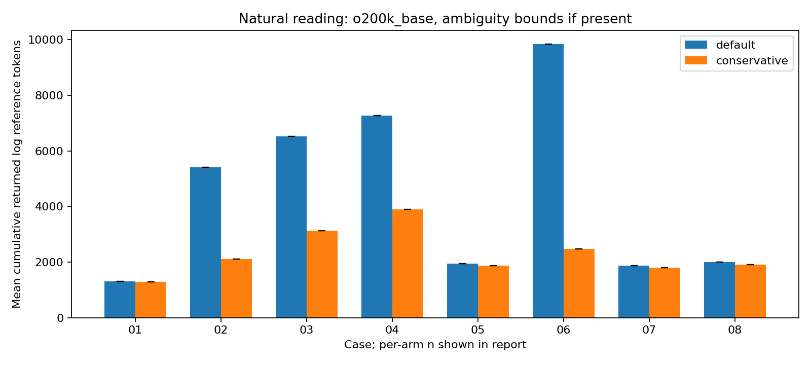
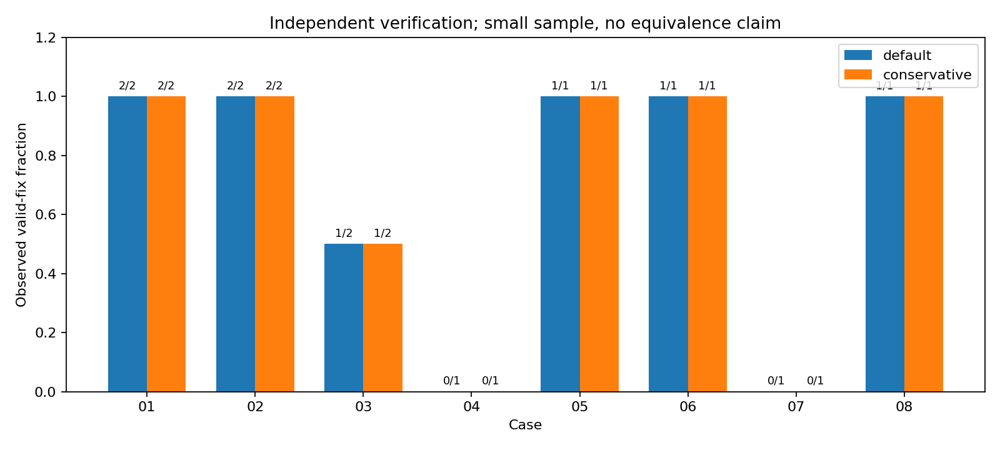

# Natural log reading during agent debugging

Revised investigation, October 2026. The unit of measurement is text returned by an agent’s chosen inspections, not a log file merely stored on disk.

## Abstract

We compared default logging with the final conservative configuration (Spring `agent` profile, case-specific duplicate exception ownership, and full Surefire reports). Both conditions received the same neutral task and could choose any reading strategy. The main schedule planned 48 trials across eight available failure cases, three per condition. At report generation, **22 trials performed debugging**, with 26 quota-related outcomes. Docker’s unavailable daemon prevented cases 09–10. A separate two-trial harness pilot is retained and excluded from main results.

Across **11 matched active trial pairs**, cumulative identifiable log-inspection text was 49,422–49,422 reference tokens for default and 25,040–25,040 for conservative, an observed reduction of **49.3%**. Bounds reflect any inseparable mixed output. These are exact `o200k_base` counts of recorded returned text, not exact Astra model token attribution. Valid independently verified fixes were **8/11 default and 8/11 conservative**. These are small, resource- and time-limited observations, not evidence of equivalence. Whole-session usage is reported separately. Prior forced-first-full-read trials are preserved as a different baseline and are not pooled with this study.

## 1. Research questions and baseline separation

RQ1: Does the conservative profile reduce cumulative text actually returned during agents’ self-selected log inspections, including repeated reads? RQ2: Do verified debugging outcomes differ? Full reads are allowed and may be an observed strategy; the experiment does not assume an agent will use grep. The primary endpoint excludes test execution and source reading unless an identifiable log segment is recovered from mixed output.

The [previous full-read report](REPORT.full-read.md), [previous instructions](README.full-read.md), and original `raw/`, `trials/`, `extracted/`, result tables and positive controls remain unchanged. Their hashes are recorded in [the baseline manifest](baselines/full-read/preserved-sha256.json). That earlier study used an aggressive P4-trimmed treatment and asked agents to start with a complete file read. It is a separate intervention, not a control arm for this revision. No old percentages or sessions enter the new primary totals.

## 2. Methods and exact task

### 2.1 Model, task and constraints

Every new session receives exactly:

> This test fails. Diagnose the cause, make the smallest correct implementation change, and verify the fix. Complete test output is available in failure.log.

The same [workspace instructions](natural-reading/main/trials/01/default/1/AGENTS.md) identify `./test.sh` and the editable implementation file, forbid changes to expectations/tests/configuration or disabling functionality, and prohibit reading evaluation data outside the workspace. They do not prescribe log reads or mention token savings. The exact prompt and instructions are stored per trial.

Model `gpt-6-astra`, low reasoning effort, Codex CLI 0.154.0-alpha.6.2, fresh ephemeral sessions, workspace-write sandbox and 120-second session wall budget are fixed across conditions. Two separate workspaces may execute concurrently. The launch schedule alternates condition order by case and repetition; concurrency means completion order can differ. [Schedule and prompt](natural-reading/main/schedule.json). No session resumes or informed evaluator sessions serve as blind trials.

### 2.2 Configuration and profile verification

Both conditions use Java 25, Spring Boot 4.1.1, Maven 3.9.16, Kotlin 2.3.21 and Surefire 3.5.6. Normal application behavior and fixtures are unchanged. Both explicitly set `-DtrimStackTrace=false`; neither enables `agent-reports`. The conservative condition additionally sets `-Dspring.profiles.active=agent -Dexperiment.deduplicate=true`. The latter only changes duplicate exception ownership in caught-database case 06, as in the prior conservative definition; ERROR events remain. The Spring profile itself remains unchanged:

```yaml
# Opt-in local console formatting. No log levels or application behavior change.
logging:
  pattern:
    console: "%d{HH:mm:ss.SSS} %level [%thread] %logger{36}: %msg%n%replace(%wEx){'(?m)^[ \\t]+at (?:org\\.junit\\.|org\\.apache\\.maven\\.surefire\\.|java\\.lang\\.reflect\\.|jdk\\.internal\\.reflect\\.)[^\\r\\n]*[\\r\\n]+',''}%nopex"
  exception-conversion-word: "%replace(%wEx){'(?m)^[ \\t]+at (?:org\\.junit\\.|org\\.apache\\.maven\\.surefire\\.|java\\.lang\\.reflect\\.|jdk\\.internal\\.reflect\\.)[^\\r\\n]*[\\r\\n]+',''}"
```

Before **each** trial, a separate Maven invocation runs `ProfileVerificationTest`. It asserts the requested/active profile match, inspects the actual Logback console encoder and writes `profile-verification.txt` outside the agent workspace. Probe stdout/stderr are separate artifacts. It also probes the unit-only case, while recognizing that the unit failure itself does not start Spring. `FailureCasesTest` no longer prints the effective regex. The measured failure log retains normal Spring startup output, including its ordinary active-profile announcement, but no custom pattern dump. [Example verified encoder](natural-reading/main/trials/02/conservative/1/profile-verification.txt).

The Kotlin compiler daemon is disabled identically to avoid the earlier known daemon-directory blocker. This environmental improvement and changed instrumentation further prevent causal comparisons with the old baseline. Network/loopback restrictions inside the agent sandbox remain a possible source of verification friction; the external verifier runs where controlled component tests can execute.

### 2.3 Isolation and independent verification

Each external temporary workspace receives only source, POM, test fixtures/resources, neutral instructions, test.sh and the complete initial `failure.log`. It receives no case manifest, reference repair, report, previous findings or trial artifacts. The evaluator verifies the intended initial failure and profile before launching the agent; failed setup is not a debugging trial. Setup’s target directory is removed before agent activity, so there are no probe reports or stale compiled repairs. `failure.log` concatenates complete stdout then stderr without truncation and without asserting inter-stream ordering.

A second pristine directory independently verifies the proposed `Defects.java` using the original tests and build command. It never trusts the agent’s scripts, target/classes or edited expectations. Immutable changes are recorded, patches and diagnoses are reviewed, and valid fixes must preserve intended functionality. Independent XML/text test reports, stdout/stderr, patches and source are retained. Setup’s generated report files are not separately retained beyond complete console output. Every process has a bounded timeout; temporary workspaces are cleaned up. Isolation is procedural/workspace-based, not an adversarial barrier against ignoring outside-read instructions.

### 2.4 Cases and repair criteria

| Case | Failure fixture | Verified criterion |
| --- | --- | --- |
| 01 | Unit assertion | 10 × 3 = 30 |
| 02 | Nested Java exception | connect completes with a valid numeric port |
| 03 | MVC binding | GET yields 200 and count=2 |
| 04 | Context startup | context starts and provides port bean |
| 05 | Database propagated | two rows with distinct emails persisted |
| 06 | Database caught and logged | two distinct users persist; saveCaught returns true |
| 07 | Local HTTP client | controlled stub returns price 42 |
| 08 | Async execution | worker returns 10 within five seconds |
| 09 | PostgreSQL container | two distinct users persist in PostgreSQL |
| 10 | Container readiness | actual worker-ready container starts before timeout |


Criteria are reused from [cases.json](cases.json) and the original tests. The nested port and startup cases require 8080. Database tests require two distinct stored emails, not dropped constraints or skipped inserts. The HTTP fixture is intentionally retained as the original two-stage problem: correcting `/wrong` to `/price` can expose `UnknownContentTypeException`; a route-only patch is incomplete. Asynchronous repairs must retain execution and propagation behavior. Reference repairs remain outside agent workspaces.

`docker info` still cannot reach the Docker Desktop daemon. Therefore cases 09–10 have no natural-reading trials, no synthetic container output and no zero-valued savings. [Exact blocker](natural-reading/environment/docker.stderr). The same real Testcontainers fixtures and bounded cleanup remain available in the reproduction protocol.

## 3. Measurement and classification

The primary measure is the cumulative `o200k_base` count of **returned log-inspection strings**, including repetitions. A file stored on disk is not automatically counted. Completed Codex command events supply `aggregated_output`; every original returned body is saved under each trial’s `returned-text/`, along with recovered log segments and character offsets. This measures the CLI-visible body, not hidden model protocol framing. The tokenizer is tiktoken 0.14.0; its installed mapping cannot establish exact `gpt-6-astra` log tokens. Actual model-reported session input, cached input and output are separate measurements.

| Class | Rule |
| --- | --- |
| Log inspection | Content reads/searches aimed at failure.log, a log file or Surefire reports; include line numbers/context formatting and repeated reads. Filename-only discovery is not a read. |
| Test command | Invoking ./test.sh or Maven; count all returned test output separately, even when it contains logging. |
| Source read | Reading code, tests, build scripts or instructions without logs, test execution, discovery or status output in that result. |
| Mixed | Combined log/source/test/discovery commands. Retain the complete body separately; recover only literal known full-log or numbered slice matches for primary attribution. |
| Other | Discovery, repository status and other command output. |


For mixed results, `cat failure.log`, simple numbered `sed`, `head` and `tail` can be attributed only when their exact expected text appears in the actual returned body. Repeated occurrences at different positions count repeatedly. No missing/truncated text is filled from the disk file. Unresolved log-containing mixed results contribute zero to the primary lower bound and the entire mixed body to the upper bound. Entire mixed-result counts are an overlapping diagnostic view and must not be added to recovered log tokens again. Segment token counts are computed independently; tokenization across different boundaries is not exactly additive.

Counters distinguish content searches, exact repeated command strings, context/slice requests, full-file cat requests and test reruns. A full-file request may be tool-truncated; only returned strings count. Context requests are not automatically claimed to be successful context expansion. All 107 completed command results were audited: 13 other, 34 mixed, 30 test-command-only, 11 log-only and 19 source-only bodies. Eleven mixed bodies contained exactly recoverable full-log segments, giving 22 observed log reads overall; none was unallocated or marked truncated. [Classification audit](natural-reading/main/classification-audit.json). The classifier’s shell-pattern rules are in [natural_analyze.py](scripts/natural_analyze.py); measurement unit checks are in [test_natural_analyze.py](scripts/test_natural_analyze.py). The full [protocol](natural-reading/PROTOCOL.md) specifies boundaries, limitations and reproduction.

## 4. Natural-reading results

### 4.1 Trial disposition

| Recorded state | Slots |
| --- | --- |
| finished | 18 |
| not_begun_quota | 2 |
| not_scheduled_quota | 24 |
| timeout | 4 |


“Not scheduled” and “model never began” do not enter active-trial success or token denominators. Quota-interrupted sessions that already used debugging tools remain active observations, with incomplete usage explicitly missing. Timeouts after genuine activity are unresolved debugging outcomes, not skipped trials. Planned three-repetition slots must not be confused with completed independent sessions. The runner stops scheduling new debugging work after a quota error; already-running sessions can finish.

| Case | Default active n | Conservative active n | Default valid fixes | Conservative valid fixes | Diagnosis recorded correct D/C |
| --- | --- | --- | --- | --- | --- |
| 01 | 2 | 2 | 2/2 | 2/2 | 2 / 2 |
| 02 | 2 | 2 | 2/2 | 2/2 | 2 / 2 |
| 03 | 2 | 2 | 1/2 | 1/2 | 1 / 1 |
| 04 | 1 | 1 | 0/1 | 0/1 | 0 / 1 |
| 05 | 1 | 1 | 1/1 | 1/1 | 1 / 1 |
| 06 | 1 | 1 | 1/1 | 1/1 | 1 / 1 |
| 07 | 1 | 1 | 0/1 | 0/1 | 1 / 1 |
| 08 | 1 | 1 | 1/1 | 1/1 | 1 / 1 |
| 09 | 0 | 0 | unobserved | unobserved | 0 / 0 |
| 10 | 0 | 0 | unobserved | unobserved | 0 / 0 |


Eight of eleven active trials per condition produced valid fixes. The unresolved cases were startup case 04 repetition 1 and MVC case 03 repetition 2 (timeouts without a patch), and HTTP case 07 repetition 1 (route-only patch, followed by UnknownContentTypeException in external verification). Both HTTP agents reported loopback socket permission failures during their own test run. No changed expectations, deleted tests or functionality-disabling repairs were accepted. Correct-diagnosis counts require recorded evidence in the explanation or explicit diagnosis, not inference solely from having read a stack trace. Missing explanations remain unknown. A passing external test does not override an invalid patch or altered expectations. Review details and unresolved causes are recorded per outcome; [main trial evidence](natural-reading/main/trials/).

### 4.2 Primary returned-log text

Mean [minimum–maximum] across active trials. Lower/upper bounds coincide when every mixed log portion is attributable. Missing cases are not assigned zero.

| Case | Default log tokens, lower | Default upper | Conservative lower | Conservative upper |
| --- | --- | --- | --- | --- |
| 01 | 1,301.5 [1,297–1,306] | 1,301.5 [1,297–1,306] | 1,297.0 [1,294–1,300] | 1,297.0 [1,294–1,300] |
| 02 | 5,408.0 [5,406–5,410] | 5,408.0 [5,406–5,410] | 2,108.5 [2,108–2,109] | 2,108.5 [2,108–2,109] |
| 03 | 6,529.0 [6,527–6,531] | 6,529.0 [6,527–6,531] | 3,135.0 [3,135–3,135] | 3,135.0 [3,135–3,135] |
| 04 | 7,273.0 [7,273–7,273] | 7,273.0 [7,273–7,273] | 3,899.0 [3,899–3,899] | 3,899.0 [3,899–3,899] |
| 05 | 1,944.0 [1,944–1,944] | 1,944.0 [1,944–1,944] | 1,871.0 [1,871–1,871] | 1,871.0 [1,871–1,871] |
| 06 | 9,849.0 [9,849–9,849] | 9,849.0 [9,849–9,849] | 2,484.0 [2,484–2,484] | 2,484.0 [2,484–2,484] |
| 07 | 1,871.0 [1,871–1,871] | 1,871.0 [1,871–1,871] | 1,797.0 [1,797–1,797] | 1,797.0 [1,797–1,797] |
| 08 | 2,008.0 [2,008–2,008] | 2,008.0 [2,008–2,008] | 1,908.0 [1,908–1,908] | 1,908.0 [1,908–1,908] |
| 09 | — | — | — | — |
| 10 | — | — | — | — |


For the 11 matched active case/repetition pairs, sum default lower/upper = **49,422/49,422**, conservative = **25,040/25,040**. The bounded reduction is **49.3%**, calculated conservatively as `1 − conservative_upper/default_lower` through `1 − conservative_lower/default_upper`. This weights longer observed inspections more heavily; it is not a universal percentage or an unweighted average of per-case savings. Unpaired sessions remain in per-case tables but are excluded from this pooled comparison.

The corresponding identifiable returned-log text totals are 175,949 bytes default and 91,834 bytes conservative. This demonstrates reduced returned text independently of whether the reference tokenizer matches Astra.



### 4.3 Observed reading strategies and separate output classes

| Case / condition | Log inspections | Search commands | Exact repeats | Context requests | Full-file requests | Test reruns |
| --- | --- | --- | --- | --- | --- | --- |
| 01 / default | 2 | 0 | 0 | 0 | 2 | 4 |
| 01 / conservative | 2 | 0 | 0 | 0 | 2 | 4 |
| 02 / default | 2 | 0 | 0 | 0 | 2 | 3 |
| 02 / conservative | 2 | 0 | 0 | 0 | 2 | 4 |
| 03 / default | 2 | 0 | 0 | 0 | 2 | 2 |
| 03 / conservative | 2 | 0 | 0 | 0 | 2 | 1 |
| 04 / default | 1 | 0 | 0 | 0 | 1 | 0 |
| 04 / conservative | 1 | 0 | 0 | 0 | 1 | 0 |
| 05 / default | 1 | 0 | 0 | 0 | 1 | 2 |
| 05 / conservative | 1 | 0 | 0 | 0 | 1 | 2 |
| 06 / default | 1 | 0 | 0 | 0 | 1 | 2 |
| 06 / conservative | 1 | 0 | 0 | 0 | 1 | 2 |
| 07 / default | 1 | 0 | 0 | 0 | 1 | 1 |
| 07 / conservative | 1 | 0 | 0 | 0 | 1 | 2 |
| 08 / default | 1 | 0 | 0 | 0 | 1 | 1 |
| 08 / conservative | 1 | 0 | 0 | 0 | 1 | 2 |


| Condition | Pure log result tokens | Test-command tokens | Source-only tokens | Whole mixed-result tokens | Other tokens | Unallocated mixed calls |
| --- | --- | --- | --- | --- | --- | --- |
| default | 33489 | 37422 | 10382 | 27671 | 10342 | 0 |
| conservative | 10362 | 22019 | 5607 | 33744 | 315 | 0 |


These output-class totals describe all active sessions, including unpaired ones. Whole mixed results include source or other text and overlap recovered primary log segments; they are shown separately rather than mislabeled as logs. Test reruns can produce large output even when the initial inspection is short. In this completed sample all 22 active sessions chose one full-file read, with no repeated log inspections or log-content searches/context expansions. Therefore the primary endpoint happens to match one returned full-log body per trial; that is an observed choice, not an assumed reading policy. Source-code rg searches and filename discovery did occur and are classified separately. The number of full-file reads is an empirical result: choosing `cat` is permitted, and the revised prompt does not force a search strategy. Raw commands and body paths are in [tool-results.csv](natural-reading/main/tool-results.csv).

### 4.4 Strategies and representative returned excerpts

These are bounded illustrations from recorded tool returns, not replacements for the full saved strings used in measurement.

**Case 01, conservative, repetition 1, result 1** — mixed; primary log attribution 1294–1294 reference tokens.

```sh
/bin/zsh -lc 'cat failure.log; cat investigation/src/test/java/com/ai/token/experiment/Defects.java; cat test.sh'
```

[Complete returned body](natural-reading/main/trials/01/conservative/1/returned-text/001.txt)

```text
[ERROR] Tests run: 1, Failures: 1, Errors: 0, Skipped: 0, Time elapsed: 0.061 s <<< FAILURE! -- in com.ai.token.experiment.FailureCasesTest
[ERROR] com.ai.token.experiment.FailureCasesTest.scenario -- Time elapsed: 0.027 s <<< FAILURE!
org.opentest4j.AssertionFailedError: total price ==> expected: <30> but was: <13>
	at org.junit.jupiter.api.AssertionFailureBuilder.build(AssertionFailureBuilder.java:158)
	at org.junit.jupiter.api.AssertionFailureBuilder.buildAndThrow(AssertionFailureBuilder.java:139)
	at org.junit.jupiter.api.AssertEquals.failNotEqual(AssertEquals.java:201)
	at org.junit.jupiter.api.AssertEquals.assertEquals(AssertEquals.java:152)
	at org.junit.jupiter.api.Assertions.assertEquals(Assertions.java:590)
	at com.ai.token.experiment.FailureCasesTest.scenario(FailureCasesTest.java:37)

[INFO] 
[INFO] Results:
[INFO] 
[ERROR] Failures: 
```

**Case 01, default, repetition 2, result 0** — log_inspection; primary log attribution 1297–1297 reference tokens.

```sh
/bin/zsh -lc 'cat failure.log'
```

[Complete returned body](natural-reading/main/trials/01/default/2/returned-text/000.txt)

```text
[ERROR] Tests run: 1, Failures: 1, Errors: 0, Skipped: 0, Time elapsed: 0.057 s <<< FAILURE! -- in com.ai.token.experiment.FailureCasesTest
[ERROR] com.ai.token.experiment.FailureCasesTest.scenario -- Time elapsed: 0.025 s <<< FAILURE!
org.opentest4j.AssertionFailedError: total price ==> expected: <30> but was: <13>
	at org.junit.jupiter.api.AssertionFailureBuilder.build(AssertionFailureBuilder.java:158)
	at org.junit.jupiter.api.AssertionFailureBuilder.buildAndThrow(AssertionFailureBuilder.java:139)
	at org.junit.jupiter.api.AssertEquals.failNotEqual(AssertEquals.java:201)
	at org.junit.jupiter.api.AssertEquals.assertEquals(AssertEquals.java:152)
	at org.junit.jupiter.api.Assertions.assertEquals(Assertions.java:590)
	at com.ai.token.experiment.FailureCasesTest.scenario(FailureCasesTest.java:37)

[INFO] 
[INFO] Results:
[INFO] 
[ERROR] Failures: 
```

**Case 02, default, repetition 1, result 1** — mixed; primary log attribution 5410–5410 reference tokens.

```sh
/bin/zsh -lc 'cat failure.log; cat investigation/src/test/java/com/ai/token/experiment/Defects.java; cat test.sh'
```

[Complete returned body](natural-reading/main/trials/02/default/1/returned-text/001.txt)

```text
2026-10-01T07:55:00.382+02:00 ERROR 51804 --- [token.usage] [           main] com.ai.token.experiment.Defects          : client setup failed

java.lang.IllegalStateException: cannot initialize client
	at com.ai.token.experiment.Defects.connect(Defects.java:20) ~[test-classes/:na]
	at com.ai.token.experiment.FailureCasesTest.scenario(FailureCasesTest.java:39) ~[test-classes/:na]
	at java.base/jdk.internal.reflect.DirectMethodHandleAccessor.invoke(DirectMethodHandleAccessor.java:104) ~[na:na]
	at java.base/java.lang.reflect.Method.invoke(Method.java:565) ~[na:na]
	at org.junit.platform.commons.util.ReflectionUtils.invokeMethod(ReflectionUtils.java:701) ~[junit-platform-commons-6.0.3.jar:6.0.3]
	at org.junit.platform.commons.support.ReflectionSupport.invokeMethod(ReflectionSupport.java:502) ~[junit-platform-commons-6.0.3.jar:6.0.3]
	at org.junit.jupiter.engine.support.MethodReflectionUtils.invoke(MethodReflectionUtils.java:45) ~[junit-jupiter-engine-6.0.3.jar:6.0.3]
	at org.junit.jupiter.engine.execution.MethodInvocation.proceed(MethodInvocation.java:61) ~[junit-jupiter-engine-6.0.3.jar:6.0.3]
	at org.junit.jupiter.engine.execution.InvocationInterceptorChain$ValidatingInvocation.proceed(InvocationInterceptorChain.java:124) ~[junit-jupiter-engine-6.0.3.jar:6.0.3]
	at org.junit.jupiter.engine.extension.TimeoutExtension.intercept(TimeoutExtension.java:163) ~[junit-jupiter-engine-6.0.3.jar:6.0.3]
	at org.junit.jupiter.engine.extension.TimeoutExtension.interceptTestableMethod(TimeoutExtension.java:148) ~[junit-jupiter-engine-6.0.3.jar:6.0.3]
```

**Case 02, conservative, repetition 1, result 1** — log_inspection; primary log attribution 2108–2108 reference tokens.

```sh
/bin/zsh -lc 'cat failure.log'
```

[Complete returned body](natural-reading/main/trials/02/conservative/1/returned-text/001.txt)

```text
07:54:41.994 ERROR [main] com.ai.token.experiment.Defects: client setup failed

java.lang.IllegalStateException: cannot initialize client
	at com.ai.token.experiment.Defects.connect(Defects.java:20) ~[test-classes/:na]
	at com.ai.token.experiment.FailureCasesTest.scenario(FailureCasesTest.java:39) ~[test-classes/:na]
	at java.base/jdk.internal.reflect.DirectMethodHandleAccessor.invoke(DirectMethodHandleAccessor.java:104) ~[na:na]
	at java.base/java.lang.reflect.Method.invoke(Method.java:565) ~[na:na]
	at java.base/java.util.ArrayList.forEach(ArrayList.java:1604) ~[na:na]
	at java.base/java.util.ArrayList.forEach(ArrayList.java:1604) ~[na:na]
	at java.base/jdk.internal.reflect.DirectMethodHandleAccessor.invoke(DirectMethodHandleAccessor.java:104) ~[na:na]
	at java.base/java.lang.reflect.Method.invoke(Method.java:565) ~[na:na]
	Suppressed: java.io.IOException: cleanup socket failed
		at com.ai.token.experiment.Defects.connect(Defects.java:21) ~[test-classes/:na]
		... 82 common frames omitted
```

No completed log-content grep/rg/awk commands were observed in this main sample. Filename discovery does not count as log-content search. Do not invent search-strategy examples where the agent instead chose full reads.

## 5. Actual session usage, time and verified outcomes

| Case / condition / repeat | Session input | Cached input | Output | Session seconds | External verification seconds | Valid fix | Status |
| --- | --- | --- | --- | --- | --- | --- | --- |
| 01 / conservative / 1 | 110009 | 99456 | 599 | 56.2 | 5.1 | True | finished |
| 01 / conservative / 2 | 110010 | 67968 | 590 | 39.3 | 5.6 | True | finished |
| 01 / default / 1 | 110134 | 99712 | 608 | 37.5 | 5.1 | True | finished |
| 01 / default / 2 | 109962 | 98688 | 644 | 41.7 | 5.3 | True | finished |
| 02 / conservative / 1 | 138128 | 117120 | 687 | 47.2 | 5.6 | True | finished |
| 02 / conservative / 2 | 97167 | 71168 | 495 | 30.1 | 5.8 | True | finished |
| 02 / default / 1 | 104794 | 80000 | 515 | 32.3 | 5.8 | True | finished |
| 02 / default / 2 | 154204 | 136576 | 654 | 40.8 | 5.6 | True | finished |
| 03 / conservative / 1 | 95375 | 84224 | 573 | 33.8 | 5.6 | True | finished |
| 03 / conservative / 2 | unavailable | unavailable | unavailable | 120.0 | 5.5 | False | timeout |
| 03 / default / 1 | 165273 | 133120 | 632 | 46.5 | 5.8 | True | finished |
| 03 / default / 2 | unavailable | unavailable | unavailable | 120.0 | 5.5 | False | timeout |
| 04 / conservative / 1 | unavailable | unavailable | unavailable | 120.0 | 5.5 | False | timeout |
| 04 / default / 1 | unavailable | unavailable | unavailable | 120.0 | 5.9 | False | timeout |
| 05 / conservative / 1 | 134095 | 114304 | 606 | 47.2 | 5.8 | True | finished |
| 05 / default / 1 | 137779 | 124672 | 679 | 43.1 | 5.9 | True | finished |
| 06 / conservative / 1 | 75966 | 50304 | 523 | 39.6 | 5.7 | True | finished |
| 06 / default / 1 | 137126 | 121216 | 667 | 45.4 | 6.3 | True | finished |
| 07 / conservative / 1 | 92998 | 81024 | 484 | 42.2 | 6.0 | False | finished |
| 07 / default / 1 | 91476 | 79616 | 547 | 34.7 | 6.6 | False | finished |
| 08 / conservative / 1 | 116838 | 94464 | 636 | 49.3 | 5.9 | True | finished |
| 08 / default / 1 | 90785 | 73216 | 586 | 34.3 | 5.7 | True | finished |


Actual usage is complete for **9 matched pairs**. Input totals: 1,101,533 default and 970,586 conservative; cached input: 946,816 and 780,032; output: 5,532 and 5,193. These are provider-reported whole-session values, not the reference-tokenized log endpoint. Cached input is included in input, not added to it. Instructions, source reads, repeated context, cache state, test runs and tool overhead can explain session differences; no attribution of all session differences to logging is made.

Elapsed session time is the Python monotonic duration recorded by the harness, including reasoning/tool activity but not initial setup; independent verification duration is separate. For valid fixes their sum is an observable time to external verification, not the exact moment the agent discovered the repair. Unresolved/time-limited trials have no successful time-to-fix. The planned 120-second subprocess timeout is the same in each condition. Some timed-out session stderr calendar timestamps span substantially longer than the recorded monotonic duration; the cause is not established (host suspension is one possible explanation). Both original timestamps and measured durations are retained; do not treat these timings as reliable uninterrupted calendar wall times. No retry/resume is silently counted as an independent trial.



## 6. Secondary complete-file and fixed-extraction comparisons

These counts describe available text and predetermined selections, **not** actual agent input unless a recorded read returned them. The same legacy marker/window/boundary/dedup rules are applied to instrument-free initial logs. Means below use generated logs from active sessions; repetitions and case availability differ with resource limits.

| Case / condition | Complete file | 20-line window | Filtered 40 | Boundary | Dedup |
| --- | --- | --- | --- | --- | --- |
| 01 / default | 1,301.5 [1,297–1,306] | 294.0 [294–294] | 622.5 [621–624] | 204.0 [204–204] | 204.0 [204–204] |
| 01 / conservative | 1,297.0 [1,294–1,300] | 294.0 [294–294] | 621.0 [620–622] | 204.0 [204–204] | 204.0 [204–204] |
| 02 / default | 5,408.0 [5,406–5,410] | 691.0 [691–691] | 107.0 [107–107] | 3,973.0 [3,973–3,973] | 3,973.0 [3,973–3,973] |
| 02 / conservative | 2,108.5 [2,108–2,109] | 372.0 [372–372] | 464.0 [464–464] | 745.0 [745–745] | 745.0 [745–745] |
| 03 / default | 6,529.0 [6,527–6,531] | 745.0 [745–745] | 188.0 [188–188] | 4,848.0 [4,848–4,848] | 4,848.0 [4,848–4,848] |
| 03 / conservative | 3,135.0 [3,135–3,135] | 723.0 [723–723] | 183.0 [183–183] | 1,620.0 [1,620–1,620] | 1,620.0 [1,620–1,620] |
| 04 / default | 7,273.0 [7,273–7,273] | 790.0 [790–790] | 126.0 [126–126] | 5,392.0 [5,392–5,392] | 5,392.0 [5,392–5,392] |
| 04 / conservative | 3,899.0 [3,899–3,899] | 768.0 [768–768] | 194.0 [194–194] | 2,164.0 [2,164–2,164] | 2,164.0 [2,164–2,164] |
| 05 / default | 1,944.0 [1,944–1,944] | 390.0 [390–390] | 666.0 [666–666] | 445.0 [445–445] | 445.0 [445–445] |
| 05 / conservative | 1,871.0 [1,871–1,871] | 390.0 [390–390] | 666.0 [666–666] | 445.0 [445–445] | 445.0 [445–445] |
| 06 / default | 9,849.0 [9,849–9,849] | 670.0 [670–670] | 747.0 [747–747] | 8,392.0 [8,392–8,392] | 8,346.0 [8,346–8,346] |
| 06 / conservative | 2,484.0 [2,484–2,484] | 648.0 [648–648] | 884.0 [884–884] | 1,105.0 [1,105–1,105] | 1,105.0 [1,105–1,105] |
| 07 / default | 1,871.0 [1,871–1,871] | 420.0 [420–420] | 412.0 [412–412] | 420.0 [420–420] | 420.0 [420–420] |
| 07 / conservative | 1,797.0 [1,797–1,797] | 420.0 [420–420] | 412.0 [412–412] | 420.0 [420–420] | 420.0 [420–420] |
| 08 / default | 2,008.0 [2,008–2,008] | 411.0 [411–411] | 353.0 [353–353] | 559.0 [559–559] | 559.0 [559–559] |
| 08 / conservative | 1,908.0 [1,908–1,908] | 389.0 [389–389] | 331.0 [331–331] | 537.0 [537–537] | 537.0 [537–537] |


Secondary full-file savings are not substituted for the cumulative observed-reading comparison. Fixed windows may omit nested causes even when their token count is low; the prior diagnostic investigation remains relevant as a content warning, not new performance evidence. [Secondary CSV](natural-reading/main/secondary-results.csv).

## 7. Limitations and interpretation

The final ordinary-suite rerun was not executed: automatic approval review rejected the requested command because its reviewer hit the account usage limit. This is separate from the captured per-trial independent verification. The prior ordinary-suite successes belong to the baseline and are not represented as new checks.

- No log-content search or context-expansion strategy was observed, so this study does not establish savings for selective grep/rg workflows. The model chooses its strategy freely but still operates on small injected fixtures with an identified editable implementation file. Generalization to large repositories or other agents is untested.
- Only eight cases can run here; real container failure and readiness diagnostics remain untested with Docker stopped.
- Three repetitions were planned; actual counts above, quota states and timeouts determine the evidence. A small sample with equal successes cannot establish equivalence or non-inferiority.
- CLI output captures visible command bodies, not every hidden serialized model-input field. Exact Astra log-token attribution is unavailable; o200k_base is a reference tokenizer.
- Mixed-output attribution is deliberately conservative. Ambiguous bodies widen bounds; full-read requests do not imply an entire file reached the model when tool truncation occurred.
- Shell command classification has finite recognized forms and requires auditing. Filesystem discovery is not a content read; test output is not silently pooled with inspections.
- Sandbox restrictions, concurrent execution, cache state, backend interruptions and wall budgets can affect success/time/usage independently of formatting. Source/test expectations and model settings are held constant, but all such external conditions cannot be randomized away.
- The conservative treatment includes narrowly scoped duplicate ownership for case 06; its contribution is not separable from prefix/trace formatting in this two-condition study.
- This revision improves instrumentation and disables the Kotlin compiler daemon in both arms. It is not a causal before/after comparison against the old full-read/P4 study.

## 8. Conclusions limited to these observations

In the 11 matched active pairs, the conservative configuration changed cumulative identifiable returned log-inspection text by a **49.3% reduction**, with ambiguity represented in the bounds rather than filled from files on disk. Agents were free to choose full reads, searches and context requests; the strategy counts show what they actually did. Verified valid fixes were **8/11 default versus 8/11 conservative**. Interpret those counts alongside the case/repetition table, not as evidence that debugging ability is unchanged. Cases or repetitions prevented by quota or Docker remain untested. Whole-session token differences are separate observations and cannot be assigned wholly to logging.

## Appendix: commands, evidence and reproducibility

```sh
python3 investigation/scripts/natural_trials.py --batch NEW_BATCH --repeats 3 --workers 2 --seconds 120
investigation/.venv/bin/python investigation/scripts/natural_analyze.py --batch NEW_BATCH
investigation/.venv/bin/python investigation/scripts/test_natural_analyze.py
```

Use fresh batch names; the runner refuses overwrite. The report generator currently summarizes `main`, making the evidence selection explicit. Per-trial `setup.json` records exact probe and initial test commands, source/test/log hashes and failure identities; `outcome.json` records actual CLI command, verification command, elapsed times and provider usage. [Integrity checks](natural-reading/verification.json) confirm identical initial implementation/test hashes across all 22 active trials, instrument-free complete captures, 22 independent test reports, and 3,663 unchanged baseline artifacts. [Raw artifact hashes](natural-reading/main/raw-manifest.json) cover original new evidence. [Manual patch and diagnosis reviews](natural-reading/main/reviews.json) remain separate from raw outcomes.

[Full protocol](natural-reading/PROTOCOL.md), [source manifest](natural-reading/manifest.json), [machine-readable trial results](natural-reading/main/trial-results.json), [tool results](natural-reading/main/tool-results.json), [all main trials](natural-reading/main/trials/), [excluded pilot](natural-reading/pilot/).

Supporting configuration documentation remains the [Spring Boot logging reference](https://docs.spring.io/spring-boot/reference/features/logging.html), [Logback layouts](https://logback.qos.ch/manual/layouts.html), [Surefire parameters](https://maven.apache.org/surefire/maven-surefire-plugin/test-mojo.html) and the locally verified Codex CLI. No new price claim is made.
